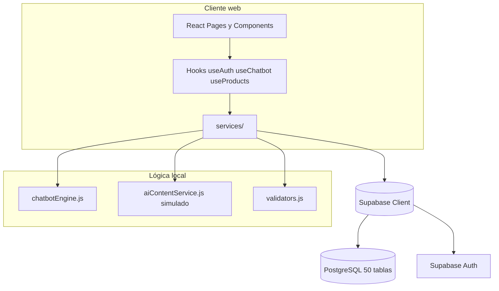

# Arquitectura del sistema NutriStore

**Proyecto de tesis:** Sistema híbrido con IA y handoff humano para gestión de redes sociales y ventas en una tienda de suplementos nutricionales  
**Aplicación:** `suplementos-app` (React + Vite + Supabase)

---

## 1. Visión general

NutriStore es una aplicación web **SPA** (Single Page Application) que conecta un frontend React con un backend **Supabase** (PostgreSQL, Auth, Storage y Row Level Security). El diseño separa:

- **Presentación** (componentes y páginas).
- **Orquestación** (hooks).
- **Negocio y persistencia** (servicios + motor local del chatbot).
- **Datos** (esquema relacional de ~50 tablas en `supabase/schema.sql`).

---

## 2. Frontend

| Elemento | Tecnología | Ubicación |
| -------- | ---------- | --------- |
| Framework UI | React 19 | `src/` |
| Bundler / dev | Vite 8 | `vite.config.js` |
| Enrutamiento | React Router 7 | `src/routes/`, `src/pages/` |
| Estilos | CSS modular por dominio | `src/styles/`, `*.css` en componentes |
| Estado global | Contexto `AuthProvider` | `src/hooks/useAuth.jsx` |

### 2.1 Rutas principales

- **Públicas:** catálogo, login, registro.
- **Cliente autenticado:** carrito, pedidos, perfil, widget de chat.
- **Vendedor:** panel de conversaciones y handoff (`/seller`).
- **Administrador:** dashboard modular (`/admin`) con secciones definidas en `utils/adminMenu.js`.

### 2.2 Patrón de capas

1. **Pages** ensamblan layouts y hooks.
2. **Components** renderizan UI y emiten eventos.
3. **Hooks** cargan datos, manejan formularios y feedback.
4. **Services** ejecutan consultas Supabase y aplican reglas.
5. **Utils** contienen funciones puras (validación, formateo, constantes).

---

## 3. Backend Supabase

Supabase actúa como **BaaS** (Backend as a Service):

- **Auth:** correo/contraseña; sesión JWT en el cliente.
- **PostgreSQL:** modelo relacional normalizado.
- **RLS:** políticas por rol (`admin`, `seller`, `customer`) en tablas sensibles.
- **Migraciones:** `supabase/migrations/` para cambios incrementales (chatbot config, redes sociales).

El cliente singleton está en `src/services/supabaseClient.js` (variables `VITE_SUPABASE_URL` y `VITE_SUPABASE_ANON_KEY`).

### 3.1 Base de datos (~50 tablas)

El archivo `supabase/schema.sql` define **51 tablas** en el esquema `public`, agrupadas por dominio:

| Dominio | Tablas representativas |
| ------- | ---------------------- |
| Seguridad y perfiles | `roles`, `permissions`, `profiles`, `role_permissions` |
| Clientes y vendedores | `customers`, `sellers`, `customer_addresses`, `customer_goals` |
| Catálogo | `products`, `product_categories`, `product_images`, `product_variants`, `product_reviews` |
| Inventario y compras | `inventory_movements`, `stock_entries`, `purchases`, `suppliers` |
| Ventas | `carts`, `orders`, `sales`, `payments`, `promotions`, `coupons` |
| Chatbot y conversaciones | `conversations`, `messages`, `chatbot_rules`, `chatbot_intents`, `chatbot_intent_definitions` |
| Handoff y soporte | `handoff_requests`, `seller_assignments`, `support_tickets` |
| Redes sociales e IA | `social_platforms`, `social_posts`, `social_campaigns`, `ai_generated_contents`, `social_metrics` |
| Sistema | `system_settings`, `notifications`, `audit_logs`, `error_logs`, `user_sessions` |

`baseService.js` centraliza helpers CRUD (`selectMany`, `insertOne`, `handleSupabaseError`) para homogeneizar errores y reducir duplicación.

---

## 4. Autenticación

1. El usuario inicia sesión vía `authService.login()` → `supabase.auth.signInWithPassword`.
2. Tras el login, se carga el **perfil** en `profiles` con rol asociado (`profileService.getProfileById`).
3. `useAuth` expone `user`, `profile`, `isAuthenticated` y métodos `login` / `logout` / `register`.
4. `ProtectedRoute` y `RoleRoute` restringen rutas según sesión y rol.
5. Errores de Auth se traducen con `utils/authErrors.js` (`mapAuthError`).

**Usuario de prueba documentado:** `admin@nutristore.test` / `NutriStore2025!`

---

## 5. Roles

| Rol | Código | Acceso típico |
| --- | ------ | ------------- |
| Administrador | `admin` | Panel `/admin`: productos, chatbot, redes, usuarios, auditoría |
| Vendedor | `seller` | Panel `/seller`: cola handoff, respuestas humanas |
| Cliente | `customer` | Catálogo, carrito, chatbot, pedidos propios |

Las funciones `isAdmin`, `isSeller`, `isCustomer` en `baseService.js` validan el rol del perfil activo antes de operaciones privilegiadas.

---

## 6. Chatbot

### 6.1 Componentes

- **Widget flotante:** `ChatWidget.jsx` + `ChatWindow.jsx` (solo usuarios autenticados).
- **Motor de reglas:** `chatbotEngine.js` (sin React ni red).
- **Persistencia:** `chatbotService.js` (conversaciones, mensajes, registro de intenciones).
- **Configuración admin:** `AdminChatbotPanel` → reglas (`chatbot_rules`), intenciones (`chatbot_intent_definitions`), ajustes globales.

### 6.2 Flujo de mensaje

1. Cliente abre el widget → `useChatbot.initConversation()` crea o reutiliza `conversations`.
2. Se cargan productos activos y reglas/intenciones desde Supabase (con **fallback local** en `chatbotFallback.js` si la BD está vacía).
3. Cada mensaje del usuario pasa por `generateBotResponse()`:
   - Reglas regex de BD (`chatbot_rules`).
   - Intenciones configurables (`chatbot_intent_definitions`).
   - Detección de handoff y compra.
   - Objetivos nutricionales legacy (masa muscular, peso, energía, etc.).
   - Consultas de precio/stock por texto.
4. La respuesta se guarda en `messages` y se muestra en la UI.

### 6.3 Handoff humano

Cuando se detecta intención de compra o frases de asesor humano:

1. `detectHumanHandoffIntent` / reglas con `triggers_handoff`.
2. `triggerHumanHandoff` crea registro en `handoff_requests`.
3. La conversación pasa a estado pendiente; el **vendedor** atiende desde su panel.
4. Mensajes del vendedor se persisten con rol `seller`.

---

## 7. IA generativa (simulada)

No se llama a un LLM externo en producción del prototipo. El módulo `aiContentService.js`:

- Genera textos por **plantillas** según plataforma (Facebook, Instagram, TikTok, WhatsApp), tono y objetivo.
- Registra historial en `ai_generated_contents`.
- Permite edición manual antes de publicar (`AIGeneratorPanel`).
- Modelo documentado: `nutristore-rules-v1` (simulado), listo para sustituir por API real.

---

## 8. Redes sociales

| Capa | Responsabilidad |
| ---- | ---------------- |
| `socialService.js` | CRUD de `social_posts`, campañas, plataformas |
| `aiContentService.js` | Generación y persistencia de borradores IA |
| `useSocialPublications.js` | Estado del panel admin |
| `AdminSocialPostsPanel` | Tabs: listado, manual, generación IA |

Campos relevantes: `product_id`, `scheduled_at`, estado (`draft`, `scheduled`, `published`).

---

## 9. Despliegue y calidad

- **Build:** `npm run build` → carpeta `dist/`.
- **Pruebas:** Vitest + jsdom + React Testing Library (`src/tests/`).
- **Calidad:** ESLint (`eslint.config.js`) y Prettier (`.prettierrc`).
- **Documentación relacionada:** `docs/CODIGO_LIMPIO.md`, `docs/REPORTE_PRUEBAS.md`, `docs/MODULOS_IMPLEMENTADOS.md`.

---

## 10. Decisiones arquitectónicas clave

1. **Motor del chatbot desacoplado** de Supabase para pruebas unitarias rápidas y mantenimiento.
2. **Fallback local** para demo académica sin depender de datos sembrados en BD.
3. **Servicios por dominio** en lugar de un único archivo monolítico.
4. **Mocks de Supabase** en pruebas para independencia de red.
5. **RLS en Supabase** como segunda línea de defensa tras validación en frontend.

---

_Documento de arquitectura — NutriStore, mayo 2026._
